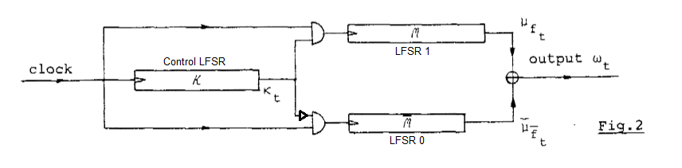

# Alternating Step Generator
A simple 4-bit [alternating step generator](https://en.wikipedia.org/wiki/Alternating_step_generator) written in Verilog.
An alternating step generator is a simple cryptographic pseudorandom number generator made up of 3 linear feedback shift registers.

Image adapted from C.G. Gunther's paper ["Alternating Step Generators Controlled by De Bruijn Sequences"](https://link.springer.com/content/pdf/10.1007/3-540-39118-5_2.pdf)
